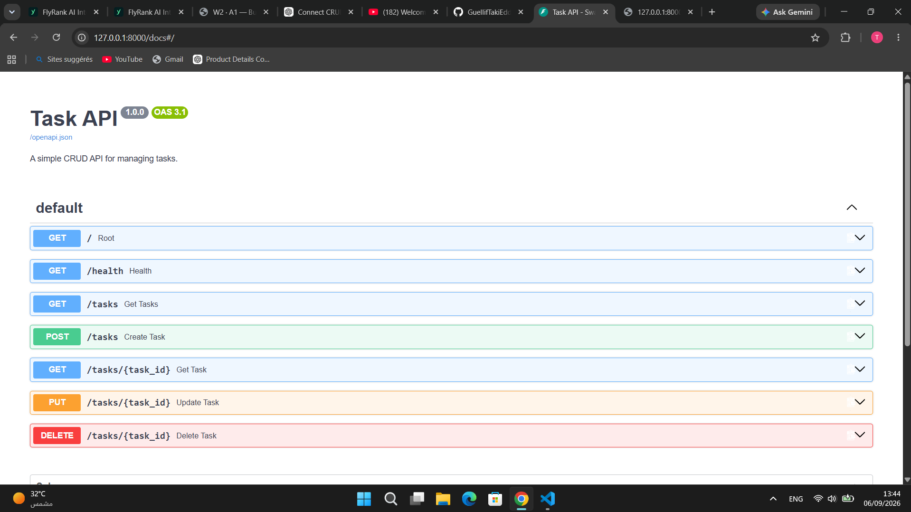

# Task API

A simple CRUD API for managing tasks, built with Python and FastAPI.

## Features

- Create tasks
- Get all tasks
- Get a single task
- Update tasks
- Delete tasks
- Automatic Swagger/OpenAPI documentation

## Requirements

- Python 3.10+

## Installation

Clone the repository:

```bash
git clone https://github.com/GuellifTakiEddine/task-api.git
cd task-api
python -m venv .venv
.venv\Scripts\activate
pip install "fastapi[standard]"
fastapi dev main.py

###The API will be available at:

http://127.0.0.1:8000

#API Endpoints
Method	Endpoint	    Description
GET	       /	        API information
GET	    /health	        Health check
GET	    /tasks	        Get all tasks
GET	    /tasks/{id}	    Get one task
POST	/tasks	        Create a task
PUT	    /tasks/{id}	    Update a task
DELETE	/tasks/{id}	    Delete a task

Example
Create a task

POST /tasks

{
  "title": "Buy milk"
}

{
  "id": 4,
  "title": "Buy milk",
  "done": false
}

Swagger UI

Interactive API documentation is available at:

http://127.0.0.1:8000/docs

## Swagger Screenshot

